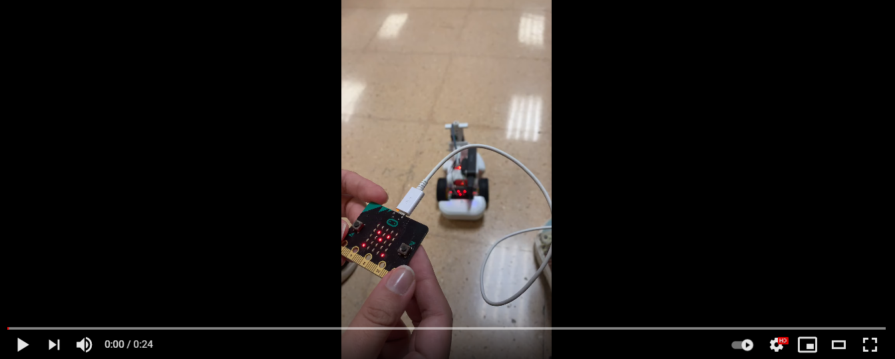

# Fabricación de ROBOT de TELEPRESENCIA
## Proyecto Final del curso de Tecnologías Industriales
*Master Universitario en Digital Manufacturing*

Desarrollado por:
* Nekane Berasategui
* Goiatz Ezpeleta
* Laura Zambrano


### Contenido:

[1. Sensorización y control mediante programación en Python](https://github.com/Berasa9/GLN/blob/main/README.md#1-sensorizaci%C3%B3n-y-control-mediante-programaci%C3%B3n-en-python)

[2. CAD y prototipado 3D](https://github.com/Berasa9/GLN/blob/main/README.md#2-cad-y-prototipado-3d)

[3. Programación de línea de packaging con Factory IO](https://github.com/Berasa9/GLN/blob/main/README.md#3-programaci%C3%B3n-de-l%C3%ADnea-de-packaging-con-factory-io)

[4. Visualización de los datos ambientales con Tableu](https://github.com/Berasa9/GLN#4-visualizaci%C3%B3n-de-los-datos-ambientales-con-tableu)

## 1. Sensorización y control mediante programación en Python
Se ha programado la funcionalidad y control del robot en Python en la plataforma [makecode](https://makecode.microbit.org/#editor) y utilizando el módulo de [gigglebot](https://gigglebot.io/). Para esta actividad se ha basado en la documentación de [Microbit](https://microbit.org/projects/make-it-code-it/).


[](https://gigglebot.io/)


Nuestro equipo propone el control remoto del robot mediante otra tarjeta microbit, a partir de señales de radiofrecuencia, tal como se observa en el siguiente fragmento de código. Por tanto, se incluye en el apartado de sensorización el código de dos microbit: uno referente al ```controlador``` (tarjeta en mano) y otro al código del gigglebot, es decir el ```robot``` de telepresencia. 


```py
#on start del controlador
x = 0 #se declara la variable x, que hace referencia al acelerómetro en la coordinada "Y" del controlador
basic.show_icon(IconNames.YES) #verificación del programa mediante la visualización en led del check (✔)
radio.set_group(27) #el valor de la frecuencia de radio es 27
radio.set_transmit_power(7) # la potencia de radio es la máxima con un valor de 7

```
A su vez, la conducción hacia delante y hacia atras del robot depende del giro del microbit ```controlador``` que hace las funciones de mando, es decir, su cambio en la velocidad con respecto al tiempo en el eje "Y". Para ello se utiliza el acelerómetro y se establecen una serie de condiciones para el rango óptimo determinado por el equipo de trabajo de ```500 mg``` (500 miligravedades es aprox 4.9 m/s2).


```py
global x #se utiliza la variable x definida de forma global
    x = input.acceleration(Dimension.Y) #X es igual a la entrada del acelerómetro en dirección Y
    if x < -500: #Si X es menor que -500mg, equivalente a un giro manual hacia delante del controlador
        radio.send_number(2) #se envia al robot el numero 2 por radio frecuencia
        basic.show_leds("""
            . . # . .
            . # # # .
            # . # . #
            . . # . .
            . . # . .
            """) #Se muestra por leds la acción de ir hacia delante en el mando
 ```

Por otra parte, la letra A indica movimiento a la izquierda, B hacia la derecha y AB que se detenga el robot. Se ha realizado la propuesta de un microbit controlador pensando en que, un manejo de control a distancia seria más conveniente que un robot autónomo para el caso de telepresencia, ya que permite ajustarse a las necesidades de quien lo maneja.


<p align="center">
    
    
    
</p>

Adicionalmente se muestran luces, flechas y caras tanto en la pantalla del controlador como en el robot segun las distintas acciones propuestas, tal y como se observa en la siguiente tabla.

| ID Acción | Acción       | Dirección     | Color led        | Descripción               |
| :-------: |:------------:|:-------------:|:----------------:|:-------------------------:|
| 1         | A            | ←             | Azul             | Girar a la izquierda      |
| 2         | Y<-500       | ↑             | Blanco           | Conducir hacia adelante   |                                       
| 3         | B            | →             | Verde            | Girar a la derecha        |                                    
| 4         | Y>+500       | ↓             | Amarillo         | Conducir hacia atras      |                                       
| 5         |    AB        | X             | Rojo             | Detenerse                 |                                                                     
                                                                                 
> Si el robot no recibe ninguna instrucción se muestra una "X" a la espera de una acción. 

El siguiente video muestra el manejo remoto con el microbit controlador del robot.

[](https://youtu.be/t_J4hAIU1Q8)

Se ha utilizado un multisensor "AmbiMate SENSOR MODULE MS4 Series" que mide Temperatura, Humedad ambiente, eCO2, VOCs en el aire, Ruido, Movimiento (PIR) e Iluminación, y se ha conectado a un Particle Argon IoT para la conexión Wi-Fi, tal como se observa en el siguiente esquema electrónico. Para este proyecto se ha utilizado para la medición de CO2

<p align="center">
    
</p>

Se ha agregado el sensor de proximidad en la parte delantera del robot, con su respectivo código para la detección de objetos que pueden ser un obstáculo para el robot, y funciones para esquilarlos (deternerse, esperar un seg y girar hacia la derecha), pensando en una medida de control de seguridad para el robot. Esto se complementa con la propuesta de modelado 3D del siguiente apartado, donde se incluye la cavidad para dicho sensor.


```py
#Detección de obstáculos, si hay un objeto cerca de 50 mm
    if gigglebot.distance_sensor_test_for_obstacle(gigglebotInequality.CLOSER, 50):
        gigglebot.stop() # se detiene el robot
        basic.show_icon(IconNames.NO) #mostrar en pantalla "X"
        lights.smile_show(NeoPixelColors.RED) #mostrar leds rojos
        basic.pause(1000) # esperar 1 segundo
        gigglebot.turn_millisec(gigglebotWhichTurnDirection.RIGHT, 1000) # y girar a la derecha
 ```

También se ha programado la detección de líneas negras como indicador de finalización de un camino, por tanto el robot se detiene siempre y cuando no se le dé otra instrucción al tiempo; por ejemplo girar a la izquierda, ya que le daría prioridad a la instruccion enviada por el ```controlador```.


## 2. CAD y prototipado 3D

Se ha modificado el diseño de dos componentes del robot; concretamente la parte trasera robot o ```back``` y la parte delantera o ```nose```. 

Como se ha mencionado anteriormente, el ```back``` se ha modificado para incluir el multisensor de CO2 del ```robot```, de acuerdo con las dimensiones de la ficha tecnia de la referencia.
<p align="center">
    
    
    

[](https://drive.google.com/file/d/1Mn-5Xggu-4ZenU1rsUKPCAtozrPfKyLX/view?usp=sharing)

El diseño del ```nose``` se ha llevado a cabo con el propósito de incluir el sensor de proximidad mencionado anteriomente, con el objetivo de poder detectar obstáculos y evitarlos para proteger el robot.
<p align="center">
    
    
    


Además, teniendo en cuenta el sistema de control del robot mediante el ```controlador``` , es decir, un microbit controlador haciendo la función de mando; se ha decidido diseñar uno para una mejor conducción. 


### Metrología con visión artificial

Para este apartado se ha tomado como base el código de detección de dimensiones de objetos del proyecto [Measuring size of objects in an image with OpenCV](https://www.pyimagesearch.com/2016/03/28/measuring-size-of-objects-in-an-image-with-opencv/) de [PyImageSearch](https://www.pyimagesearch.com/)

## 3. Programación de línea de packaging con Factory I/O

Factory I/O es un programa de aprendizaje que permite simular la programación de los diferentes PLCs que existen en el mercado. El programa consta de diferentes escenas que recrean las apliaciones más comunes de los autómatas en la industria. También cuenta con la opción de crear escenas específicas empleando los diferentes elementos diponibles.

En este caso se va a simular la programación de la escena "Sorting by height (Basic)" mediante Control I/O, un controlados creado por Factory I/O que permite programar la lógica por bloques funcionales. El proposito de esta escena, como se puede ver en el siguinete vídeo, es poder clasificar las cajas que llegan desde una cinta transportadora por su tamaño (grandes o pequeñas), y dependiendo del tamaño saldrán por una cinta transportadora u otra.

[](https://youtu.be/ovqaNmYiTf4)

A continuación se analizará y explicarán los elementos y la lógica usada para la automatización del sistema de clasificación.

### Elementos del programa
La programación en Control I/O se hace mediante bloques. Estos bloques se clasifican entre sensores (input), actuadores (output), memorias y bloques funcionales lógicos.
Los inputs, outputs y las memorias poseen un nombre y dirección que permite identificarlos y posicionarlos en la memoria interna de Control I/O de tal manera que se puede configurar facilmente un diagrama con los elementos que forman la escena configurando las direcciones correctas para las entradas y salidas.

#### Inputs
Los inputs son los bloques verdes que se emplean en el esquema y representan los sensores instalados en la escena. Los sensores que encontramos en el programa son los siguientes:
* **(5)** High sensor: Sensor que detecta las cajas grandes.
* **(6)** Low sensor: Este sensor detecta tanto las cajas grandes como las pequeñas.
* **(7)** Pallet sensor: Sensor que detecta los pallets.
* **(8)** At left entry: Detecta cuando una caja sale hacia la cinta izquierda.
* **(10)** At right exit: Detecta cuando una caja ha salido de la cinta derecha.
* **(11)** At left exit: Detecta cuando una caja ha salido de la cinta izquierda.
* **(12)** At right entry: Detecta cuando una caja sale hacia la cinta derecha.
* **(16)** Loaded: Detecta cuando un pallet está cargado correctamente en la unidad de transferencia.

#### Outputs
Los output o actuadores son los elementos que accionarán un proceso cuando las condiciones especificadas se cumplan. En el diagrama, los actuadres están representados mediante bloques rojos y en este caso corresponden a los motores que mueven las cintas transportadoras y la unidad de transfererncia.
* **(0)** Load: Acciona la unidad de transferencia para cargar las cajas en la misma.
* **(2)** Transf. Left: Envía las cajas desde la unidad de transferencia a la cinta de la izquierda.
* **(3)** Transf. Right: Envía las cajas desde la unidad de transferencia a la cinta de la derecha.
* **(4)** Conveyor entry: Acciona la cinta transportadora de entrada.
* **(5)** Conveyor left: Acciona la cinta de la izquierda (cajas grandes).
* **(6)** Conveyor right: Acciona la cinta de la derecha (cajas pequeñas).

#### Memorias
Las memorias son bloques que guardan valores durante la ejecución del programa. Son representados mediante bloques morados en el diagrama, y al contrario que los input y output que Control I/O detecta automáticamente los que se encuentran en la escena, las memorias hay que crearlas. En este caso las memorias creadas guardarán valores booleanos (Verdadero/Falso) y son los siguientes:
* **(0)** Loading: Guardará un valor mientras que se esté cargando un pallet en la unidad de transferencia.
* **(1)** Transfer busy: Memoria que guardará un valor siempre que haya una caja en el transfer.

#### Bloques funcionales lógicos
Los bloques funcionales describen una función entre las entradas y las salidas. Pueden ser de diferentes tipos pero en este proyecto se van a emplear los bloques funcionales lógicos. Conectando los bloques funcionales con las entradas, salidas y memorias se consigue programar la escena en el que cuando se cumplan las circunstancias necesarias, se iniciarán los procesos. Los bloque sfuncionales empleados son lso siguientes:
* **AND2:**  Está compuesto de dos entradas y una salida. En el caso de que se cumplan las dos entradas, se dará la salida.
* **OR2:** Está compuesto de dos entradas y una salida. Solo es necesario qeu se cumpla una de las entradas para que se de la salida.
* **NOT:** Consta de una entrada y una salida, devuelve el valor contrario que entra en el bloque (True → False / False → True).
* **SR:** Es una memoria con prioridad en set. Consta de dos entradas (Set y Reset) y una salida. La salida se activará cuando se de entrada por el set y se desactivará cuando se de entrada por el reset, en caso de que las dos entradas se den a la vez, tendrá prioridad el set.
* **FTRIG:** Es un bloque con una entrada y una salida, dará la salida cuando detecte que la señal de la entrada pasa de Verdadero a Falso.
* **RTRIG:** Es un bloque con una entrada y una salida, dará la salida cuando detecte que la señal de la entrada pasa de Falso a Verdadero.

### Programación de la escena
La programación de la escena se ha hecho por bloques ya que aunque las accioines que se realizan en la escena están relacionadas entre si por que algunas acciones se dan después de otras, los sucesos para que estas acciones ocurran son específicos para cada una de ellas.

## 4. Visualización de los datos ambientales con Tableu 
Mediante la plataforma Tableau se han visualizado varias gráficas relacionadas con datos de clima recogidos en Elgoibar durante los años 2016 y 2017. 

[](https://public.tableau.com/views/dashboard_16082122007840/Dashboard1?:showVizHome=no#2)

Los parámetros que se han medido durante este periodo son los siguientes:

* Fecha de captura
* Calidad del Aire (cualitativo)
* Índice de Calidad del Aire (cuantitativo)
* CO2 (ug/m3)
* Humedad Rh (%)
* Temperatura (ºC)
* Grado de partículas suspendidas en el aire de diámetro 2.5 micras o inferior. (cualitativo)
* Número de partículas suspendidas en el aire de diámetro 2.5 micras o inferior. PM 2.5 (cuantitativo)


Análisis de las gráficas publicadas: 
### CALIDAD DEL AIRE
La calidad del aire se mide según 4 contaminantes perjudiciales tanto para la salud de las personas como para el mediambiente:
* Ozono troposférico (O3)
* Dióxido de nitrógeno (NO2)
* Dióxido de azufre (SO2)
* Partículas en suspensión (PM 2,5 y PM10)

#### Valoración de la Calidad del aire. 
Se han relacionado datos cuantitativos y cualitativos para que de manera visual se aprecie el grado de la calidad del aire


#### Relación de la calidad del aire y la carga de partículas PM2.5
Las partículas que se encuentran en suspensión en el aire se miden según dos tamaños: PM2.5 y PM10. Las PM 2.5 tienen un diámetro igual o menor a 2.5 micras y las PM10 un diámetro igual o inferior a 10 micrómetros. En el análisis llevado a cabo en este proyecto, únicamente se tienen datos de PM2.5
En la siguiente gráfica se percibe la clara relación entre la carga de partículas y la calidad del aire PM2.5. 


### Valores promedio de Temperatura (ºC), Humedad (%Rh) y CO2 (ug/m3)
La gráfica que se ve a continuación se ha creado para la consulta de los tres parámetros anteriormente mencionados entre los años los años 2016 y 2017.


       
